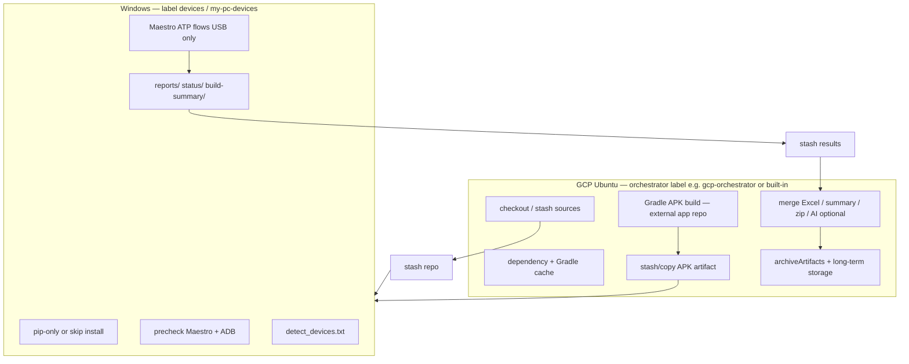

# Distributed GCP + Windows Hybrid Architecture (Maestro ATP)

**Status:** Planning + opt-in tooling. The default job continues to use root `Jenkinsfile` unchanged.

This repository is a **Maestro flow + Jenkins CI** project. It does **not** contain an Android app module or Gradle build. APK/Gradle work lives in a **separate app repository** (or future pipeline hook). This document maps your target split onto what exists today and defines a rollback-safe migration path.

---

## 1. Current state (as implemented in repo)

### 1.1 Jenkins topology today

| Stage | Agent label | OS | Role |
|-------|-------------|-----|------|
| Fetch Code from GitHub | `built-in` | GCP VM (controller) | `checkout scm` + `stash name: 'repo'` |
| Install Dependencies → Post-build cleanup | `params.DEVICES_AGENT` (`devices` / `my-pc-devices`) | Windows USB host | Full workspace per stage (`deleteDir` + `unstash` on install) |
| All ATP Maestro runs | `DEVICES_AGENT` | Windows | `jenkins_atp_stage.py` → `execution/atp_jenkins_orchestrator.py` → `run_one_flow_on_device.bat` |
| Excel / AI / email / archive | `DEVICES_AGENT` | Windows | Python + `.bat` wrappers |

**Data flow:** Controller stashes sources → Windows agent unstashes → Maestro writes `reports/`, `status/`, `build-summary/` on Windows → `archiveArtifacts` from Windows workspace.

### 1.2 Execution chain (device — must stay on Windows)

```
Jenkins (Windows agent)
  → python scripts/jenkins_atp_stage.py
  → python -m execution.atp_jenkins_orchestrator  (blocking; device lease)
  → scripts/run_one_flow_on_device.bat
  → maestro.bat test <flow.yaml>
  → USB device (ADB)
```

**Do not move:** `run_one_flow_on_device.bat`, Maestro, ADB, `detected_devices.txt` generation, per-flow logs under `reports/<suite>/logs/`.

### 1.3 What is already centralized (GCP controller)

- Git checkout (`built-in` agent).
- Stash of sources (excludes `.git`, `reports/`, `build-summary/`, etc.).

### 1.4 What still runs on Windows (candidates to shift later)

| Workload | Script(s) | Portable to Ubuntu? |
|----------|-----------|---------------------|
| pip install | `jenkins_ci_install.bat` | Yes (already optional npm) |
| ATP Excel merge | `jenkins_ci_merge_atp.bat`, `generate_atp_excel_reports.py` | Yes |
| Build summary | `jenkins_ci_build_summary.bat`, `generate_build_summary.py` | Yes |
| Zip logs | `jenkins_ci_zip_logs.bat`, `mailout/send_email.py` | Yes |
| AI analysis | `jenkins_ci_ai_analysis.bat`, `intelligent_platform/*` | Yes (needs `OPENROUTER_API_KEY`) |
| Archive | Jenkins `archiveArtifacts` | Yes (any agent) |
| Maestro ATP runs | `execution/atp_jenkins_orchestrator.py` | **No** (Windows + USB) |
| Device detect | `jenkins_ci_devices.bat`, `list_devices.bat` | **No** |
| Precheck Maestro/ADB | `jenkins_ci_precheck.bat` | **No** |

### 1.5 Hardcoded Windows paths (parameter defaults only)

`Jenkinsfile` parameters default to one machine’s paths (override per agent/job):

- `MAESTRO_HOME` → `C:\Users\HP\maestro\maestro\bin`
- `ANDROID_HOME` → `C:\Users\HP\AppData\Local\Android\Sdk`
- `JAVA_HOME_OVERRIDE` → `C:\Users\HP\.jdks\jbr-17.0.8`

**Action:** Set job parameters or node environment variables per agent; do not rely on repo defaults in production.

### 1.6 No Gradle in this repo

Gradle/APK build on GCP requires:

1. Checking out the **Android app repo** on `gcp-orchestrator` (or `built-in`).
2. Running `./gradlew assembleDebug` (or your flavor).
3. Publishing APK via **stash**, **Copy Artifact**, or object storage → Windows agent installs before Maestro (`adb install -r` is **not** in current flows — app is assumed pre-installed; add only if product requires it).

---

## 2. Target architecture (your requirements mapped)



### 2.1 GCP Ubuntu server responsibilities

- Jenkins controller or dedicated `gcp-orchestrator` agent (Linux).
- Git fetch / stash preparation (already on controller).
- **Future:** Gradle assemble, sign, cache (`~/.gradle`, SDK on GCP only).
- Post-run: `scripts/gcp/jenkins_ci_post_reports.sh` (Excel merge, summary, zip).
- Artifact storage, Allure/JUnit if added later.
- Retry/orchestration policy at pipeline level (same Groovy, different `agent` blocks).

### 2.2 Windows machine responsibilities (unchanged semantics)

- Jenkins agent with USB devices.
- ADB + platform-tools + Maestro + JBR 17 for Maestro only.
- `jenkins_ci_install_windows_device.bat` — lightweight pip (see scripts).
- All Maestro YAML execution unchanged.
- `detected_devices.txt` / device detection unchanged.

---

## 3. Jenkins node separation (enterprise-ready labels)

| Label | Platform | Usage |
|-------|----------|--------|
| `built-in` or `gcp-orchestrator` | Linux | Checkout, stash, Gradle, post-report, archive |
| `devices` | Windows | USB Maestro execution (default `DEVICES_AGENT`) |
| `my-pc-devices` | Windows | Alternate lab machine |

**Parameters (recommended additions when enabling hybrid file):**

| Parameter | Purpose |
|-----------|---------|
| `GCP_ORCHESTRATOR_AGENT` | Label for Linux stages (default `built-in`) |
| `DEVICES_AGENT` | Unchanged |
| `USE_HYBRID_POST_ON_GCP` | When true, post-processing stages run on GCP (opt-in) |
| `APK_STASH_NAME` | Stash name for APK from Gradle stage (default `app-apk`) |

---

## 4. Artifact transfer (APK → Windows)

**Options (pick one; all rollback-safe):**

1. **Jenkins stash** (simple, same controller)  
   - GCP: `stash name: 'app-apk', includes: '**/*.apk'`  
   - Windows: `unstash 'app-apk'` before device stages (only if you add `adb install`).

2. **Copy Artifact / archiveArtifacts**  
   - GCP archives `app/build/outputs/apk/**/*.apk`  
   - Windows job copies with `copyArtifacts` (multibranch) or shared storage.

3. **GCS bucket** (best for large APK + cache)  
   - GCP uploads `gs://bucket/builds/${BUILD_NUMBER}/app.apk`  
   - Windows: `gsutil cp` or Jenkins GCS plugin before tests.

**Current repo:** Maestro assumes `APP_PACKAGE` is already on device (`pm path` check in `run_one_flow_on_device.bat`). APK transfer is **optional** until you add an install step.

---

## 5. Cache optimization

| Location | What to cache | What to avoid on Windows |
|----------|---------------|---------------------------|
| GCP | `~/.gradle/caches`, Android SDK (build), pip in **`$HOME/jenkins-venvs/kodak-atp-orchestrator`** (PEP 668 safe) | — |
| Windows | None required for orchestration; keep `~/.maestro` trimmed via `safe_disk_cleanup.bat PRE` | Duplicate `npm`, full Gradle, second Git clone |
| Jenkins controller | Stash excludes already trim `.git`, `reports/`, `build-summary/` (see `Jenkinsfile`) | `preserveStashes(buildCount: 2)` |

**Env flags already supported:**

- `JENKINS_SKIP_NPM=1` / `SKIP_NPM_INSTALL=1` — skip Node on Windows.
- `SAFE_DISK_CLEANUP_CONFIRM_CACHE=YES` — rare npm/pip cache trim on agent.

**Windows light install:** `scripts/jenkins_ci_install_windows_device.bat` sets `JENKINS_SKIP_NPM=1` and calls existing install.

---

## 6. Folder structure (recommended)

```
repo-root/
  Jenkinsfile                          # DEFAULT — unchanged behavior
  Jenkinsfile.hybrid.gcp-windows       # OPT-IN hybrid routing
  ATP TestCase Flows/                  # Maestro — never moved
  flows/ elements/                     # Maestro — never moved
  scripts/
    jenkins_ci_*.bat                   # Windows device + current CI
    jenkins_ci_install_windows_device.bat
    gcp/
      jenkins_ci_install.sh            # GCP pip/orchestrator deps
      jenkins_ci_post_reports.sh       # GCP post-run processing
      README.md
  execution/                           # Blocking ATP orchestrator
  reports/ status/ build-summary/      # Generated; stashed GCP ← Windows when hybrid
  docs/
    DISTRIBUTED_GCP_WINDOWS_ARCHITECTURE.md  # this file
```

---

## 7. Files: Windows vs GCP

### 7.1 Must remain on Windows (do not relocate)

- `scripts/run_one_flow_on_device.bat`
- `scripts/set_maestro_java.bat`
- `scripts/jenkins_ci_devices.bat`, `list_devices.bat`
- `scripts/jenkins_ci_precheck.bat`
- `execution/atp_jenkins_orchestrator.py` (invoked on Windows today)
- `scripts/run_atp_testcase_flows.bat` / `.ps1` (legacy local)
- All `*.yaml` under `ATP TestCase Flows/`, `flows/`, `Printing Flow/`, etc.
- `config.yaml` (Maestro workspace)

### 7.2 Can move to GCP (post-run, no device)

- `scripts/jenkins_ci_merge_atp.bat` → `scripts/gcp/jenkins_ci_post_reports.sh` (merge section)
- `scripts/jenkins_ci_build_summary.bat`
- `scripts/jenkins_ci_zip_logs.bat`
- `scripts/jenkins_ci_ai_probe.bat`, `jenkins_ci_ai_analysis.bat` (if API key on GCP)
- `archiveArtifacts` stage
- Future Gradle driver script (external app repo)

### 7.3 Shared (both sides need checkout or stash)

- Python sources: `scripts/*.py`, `excel/`, `intelligent_platform/`, `mailout/`
- `scripts/requirements-python.txt`
- Stashed `repo` without generated dirs

---

## 8. Safe migration steps (phased)

### GCP agent one-time OS packages

```bash
sudo apt install -y python3-venv python3-pip
```

Orchestrator Python deps install into **`$HOME/jenkins-venvs/kodak-atp-orchestrator`** (not system pip). Override with `JENKINS_ORCHESTRATOR_VENV`.

### Phase 0 — Today (no pipeline change)

1. Use job parameters for `MAESTRO_HOME`, `ANDROID_HOME`, `JAVA_HOME_OVERRIDE` per Windows agent.
2. Set `JENKINS_SKIP_NPM=1` on Windows device jobs (or use `jenkins_ci_install_windows_device.bat`).
3. Keep `Jenkinsfile` as production entry.

### Phase 1 — Logging visibility

1. Echo `[workload] profile=windows-device` / `gcp-orchestrator` in install scripts (implemented in bat/sh).
2. Read `reports/<suite>/orchestrator_lifecycle.log` for Maestro session issues (already on Windows).

### Phase 2 — Opt-in hybrid pipeline

1. Create multibranch job **“HP Sprocket Android (Hybrid)”** with `Jenkinsfile.hybrid.gcp-windows`.
2. Verify one folder ATP run on Windows only (same commands).
3. Enable GCP post-processing: stash `reports/**`, `status/**`, `build-summary/**` from Windows → unstash on GCP → run `scripts/gcp/jenkins_ci_post_reports.sh`.

### Phase 3 — Gradle on GCP (external repo)

1. Add pipeline stage on `gcp-orchestrator` checking out app repo.
2. Stash APK; document install step if needed.
3. Windows unchanged Maestro flow.

### Rollback

- Switch job Script Path back to `Jenkinsfile`.
- Disable hybrid parameters.
- No YAML or Maestro changes required.

---

## 9. Logging: server vs Windows

| Log | Where |
|-----|--------|
| Jenkins stage console | Tagged by agent name in Blue Ocean |
| `[workload] profile=...` | Install scripts |
| `reports/<suite>/logs/*.log` | Windows (Maestro) |
| `reports/<suite>/orchestrator_lifecycle.jsonl` | Windows (device lease / bat invoke) |
| GCP post-processing | Prefix `[gcp-post]` in `jenkins_ci_post_reports.sh` |

---

## 10. What we are NOT changing (per requirements)

- Maestro YAML / test intent / assertions
- `run_one_flow_on_device.bat` behavior (only prior infra fixes)
- Device detection logic
- USB-only execution (no emulator / wireless ADB substitution)
- Default `Jenkinsfile` pipeline graph
- Excel schema / AI response logic / report output paths (when post-processing moves, same scripts produce same files)

---

## 11. Implementation added in repo (minimal)

| Artifact | Purpose |
|----------|---------|
| `Jenkinsfile.hybrid.gcp-windows` | Opt-in pipeline; default job untouched |
| `scripts/jenkins_ci_install_windows_device.bat` | Windows light install |
| `scripts/gcp/jenkins_ci_install.sh` | GCP orchestrator pip deps |
| `scripts/gcp/jenkins_ci_post_reports.sh` | GCP merge/summary/zip |
| `scripts/gcp/README.md` | Quick operator notes |

Enable hybrid only when operators deliberately point the Jenkins job at `Jenkinsfile.hybrid.gcp-windows`.
